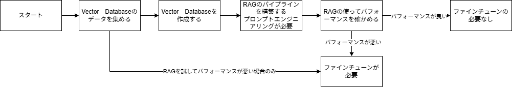

# 生成AIのチュートリアル

生成AIのストラテジー：

  

基本的に生成AIは従来のモデルと違い、大きなGPUが求められる。  
なので、すぐにファインチューンを実行するのはNG。  
最初にRAGを運用して、生成AIのパフォーマンスを確認するのがベター。  
このレポは、そのチュートリアル用として作成してます。

1. Vector_Database
  - ChromaDB_Basic: ChromaDBを使い方の基礎とテキストを保存/検索する方法（data.csvを使って下さい）
  - ChromaDB_Text_Image: ChromaDBにイメージを保存・検索する方法（images/imageを使って下さい）
  - ChromaDB_LLAMA_Custom: ChromaDBにカスタムEmbeddingを使いデータを保存／検索する方法（data.csvを使って下さい）

2. RAG
  - Chrma_RAG_LLAMA: LLAMA２とRAGの組み合わせて使う方法（HuggingFaceの「無料」トークンが必要です）

3. Fine-Tune
  - LLAMA_Fine_Tune: LLAMA２(ELYZA-japanese-Llama-2-7b)をQLoRAを使ってファインチューンする方法
